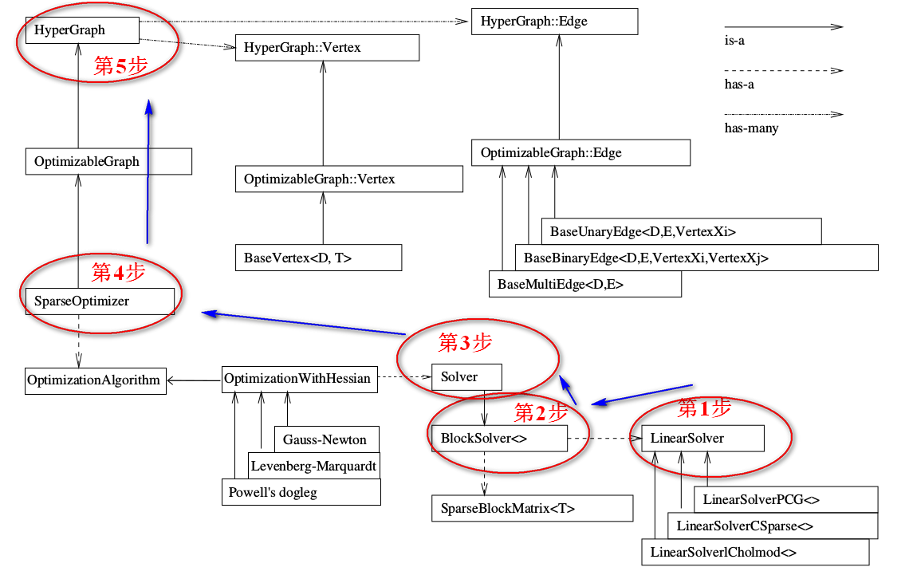

## g2o的使用



### 1、创建一个线性求解器LinearSolver

```c++
typedef g2o::BlockSolver<g2o::BlockSolverTraits<3, 1>>
        Block;typedef // 每个误差项优化变量维度为3，误差值维度为1
// BlockSolver_6_3 ：表示pose 是6维，观测点是3维。用于3D SLAM中的BA
// BlockSolver_7_3：在BlockSolver_6_3 的基础上多了一个scale
// BlockSolver_3_2：表示pose 是3维，观测点是2维

 //1、
// Block::LinearSolverType *linearsolver =
    //     new g2o::LinearSolverDense<Block::PoseMatrixType>();
  //2、
    std::unique_ptr<Block::LinearSolverType> linearsolver(
        new g2o::LinearSolverDense<Block::PoseMatrixType>());
```

我们要求的增量方程的形式是：H△X=-b，通常情况下想到的方法就是直接求逆，也就是△X=-H.inv*b。看起来好像很简单，但这有个前提，就是H的维度较小，此时只需要矩阵的求逆就能解决问题。但是当H的维度较大时，矩阵求逆变得很困难，求解问题也变得很复杂。

LinearSolverCholmod ：使用sparse cholesky分解法。继承自LinearSolverCCS；
LinearSolverCSparse：使用CSparse法。继承自LinearSolverCCS；
LinearSolverPCG ：使用preconditioned conjugate gradient 法，继承LinearSolver；
LinearSolverDense ：使用dense cholesky分解法。继承自LinearSolver；
LinearSolverEigen： 依赖项只有eigen，使用eigen中sparse Cholesky 求解，因此编译好后可以方便的在其他地方使用，性能和CSparse差不多。继承LinearSolver；

### 2、创建BlockSolver。并用上面定义的线性求解器初始化。

BlockSolver 内部包含 LinearSolver，用上面我们定义的线性求解器LinearSolver来初始化

```c++
// Block* solver_ptr = new Block( linearSolver );
std::unique_ptr<Block> solver_ptr(new Block(std::move(linearsolver)));
```

### 3、创建总求解器solver。并从GN, LM, DogLeg 中选一个，再用上述块求解器BlockSolver初始化
```c++
// g2o::OptimizationAlgorithmGaussNewton
// g2o::OptimizationAlgorithmLevenberg
// g2o::OptimizationAlgorithmDogleg
g2o::OptimizationAlgorithmGaussNewton *solve = new g2o::OptimizationAlgorithmGaussNewton(std::move(solver_ptr));
```

### 4、创建终极大boss 稀疏优化器（SparseOptimizer），并用已定义求解器作为求解方法。

```c++
g2o::SparseOptimizer optimizer;
SparseOptimizer::setAlgorithm(OptimizationAlgorithm* algorithm);
SparseOptimizer::setVerbose(bool verbose);

// 这个更好用
//g2o::SparseOptimizer optimizer;
//g2o::OptimizationAlgorithmProperty solverProperty;
//optimizer.setAlgorithm(g2o::OptimizationAlgorithmFactory::instance()->construct("lm_dense", solverProperty));

```

### 5、定义图的顶点和边。并添加到SparseOptimizer中。

#### g2o的顶点（Vertex) 参数如何理解？

D是int 类型的，表示vertex的最小维度，比如3D空间中旋转是3维的，那么这里 D = 3;
T是待估计vertex的数据类型，比如用四元数表达三维旋转的话，T就是Quaternion 类型;

```c++
static const int Dimension = D; ///< dimension of the estimate (minimal) in the manifold space
typedef T EstimateType;
EstimateType _estimate;
```

```c++
VertexSE2 : public BaseVertex<3, SE2>
//2D pose Vertex, (x,y,theta)
VertexSE3 : public BaseVertex<6, Isometry3>
//6d vector (x,y,z,qx,qy,qz) (note that we
leave out the w part of the quaternion)
VertexPointXY : public BaseVertex<2, Vector2>
VertexPointXYZ : public BaseVertex<3, Vector3>
VertexSBAPointXYZ : public BaseVertex<3, Vector3>
// SE3 Vertex parameterized internally with a transformation matrix and externally with
its exponential map
VertexSE3Expmap : public BaseVertex<6, SE3Quat>
// SBACam Vertex, (x,y,z,qw,qx,qy,qz),(x,y,z,qx,qy,qz) (note that we leave out the w part of the quaternion.
// qw is assumed to be positive, otherwise there is an ambiguity in qx,qy,qz as a
rotation
VertexCam : public BaseVertex<6, SBACam>
// Sim3 Vertex, (x,y,z,qw,qx,qy,qz),7d vector,(x,y,z,qx,qy,qz) (note that we leave out
the w part of the quaternion.
VertexSim3Expmap : public BaseVertex<7, Sim3>
```

顶点中的四个主要函数：

```c++
virtual bool read(std::istream& is);
virtual bool write(std::ostream& os) const;
//分别是读盘、存盘函数，一般情况下不需要进行读/写操作的话，仅仅声明一下就可以

virtual void oplusImpl(const number_t* update);
// 更新不就是 x + △x 吗，这是定义吧
//顶点更新函数。非常重要的一个函数，主要用于优化过程中增量△x 的计算。我们根据增量方程计算出增量之后，就是通过这个函数对估计值进行调整的，因此这个函数的内容一定要重视。
virtual void setToOriginImpl();
// 顶点重置函数，设定被优化变量的原始值。
```

```c++
// 往图中增加顶点
CurveFittingVertex* v = new CurveFittingVertex();
v->setEstimate( Eigen::Vector3d(0,0,0) );
v->setId(0);
optimizer.addVertex( v );
```

```c++
int index = 1;
for ( const Point3f p:points_3d )
// landmarks
{
g2o::VertexSBAPointXYZ* point = new g2o::VertexSBAPointXYZ();
point->setId ( index++ );
point->setEstimate ( Eigen::Vector3d ( p.x, p.y, p.z ) );
point->setMarginalized ( true );
optimizer.addVertex ( point );
}
```

#### 边

BaseUnaryEdge，BaseBinaryEdge，BaseMultiEdge 分别表示一元边，两元边，多元边。

D, E, VertexXi, VertexXj，他们的分别代表：D 是 int 型，表示测量值的维度 （dimension） E 表示测量值的数据类型 VertexXi，VertexXj 分别表示不同顶点的类型。

```c++
// 三维点投影到图像平面的重投影误差
BaseBinaryEdge<2, Vector2D, VertexSBAPointXYZ, VertexSE3Expmap>;
// 第1个2是说测量值是2维的，也就是图像像素坐标x,y 的差值，对应测量值的类型是Vector2D，两个顶点也就是优化变量分别是三维点 VertexSBAPointXYZ，和李群位姿 VertexSE3Expmap
```

```c++
virtual bool read(std::istream& is);
virtual bool write(std::ostream& os) const;
virtual void computeError();
//computeError函数：非常重要，是使用当前顶点的值计算的测量值与真实的测量值之间的误差
virtual void linearizeOplus();
//linearizeOplus函数：非常重要，是在当前顶点的值下，该误差对优化变量的偏导数，也就是我们说的Jacobian
```

```c++
_measurement：存储观测值
_error：存储computeError() 函数计算的误差
_vertices[]：存储顶点信息，比如二元边的话，_vertices[] 的大小为2，存储顺序和调用
setVertex(int,vertex) 是设定的int 有关（0 或1）
setId(int)：来定义边的编号（决定了在H矩阵中的位置）
setMeasurement(type) 函数来定义观测值
setVertex(int, vertex) 来定义顶点
setInformation() 来定义协方差矩阵的逆
```

```c++
// 误差模型 模板参数：观测值维度，类型，连接顶点类型
class CurveFittingEdge: public g2o::BaseUnaryEdge<1,double,CurveFittingVertex>
{
public:
EIGEN_MAKE_ALIGNED_OPERATOR_NEW
CurveFittingEdge( double x ): BaseUnaryEdge(), _x(x) {}
// 计算曲线模型误差
void computeError()
{
const CurveFittingVertex* v = static_cast<const CurveFittingVertex*>
(_vertices[0]);
const Eigen::Vector3d abc = v->estimate();
_error(0,0) = _measurement - std::exp( abc(0,0)*_x*_x + abc(1,0)*_x + abc(2,0) )
;
}
virtual bool read( istream& in ) {}
virtual bool write( ostream& out ) const {}
public:
double _x;
// x 值， y 值为 _measurement
};
```

重投影误差

```c++
//继承了BaseBinaryEdge类，观测值是2维，类型Vector2D,顶点分别是三维点、李群位姿
class G2O_TYPES_SBA_API EdgeProjectXYZ2UV : public
VertexSBAPointXYZ, VertexSE3Expmap>{
public:
EIGEN_MAKE_ALIGNED_OPERATOR_NEW;
//1. 默认初始化
EdgeProjectXYZ2UV();
//2. 计算误差
void computeError()
{
//李群相机位姿v1
const VertexSE3Expmap* v1 = static_cast<const VertexSE3Expmap*>(_vertices[1]);
// 顶点v2
const VertexSBAPointXYZ* v2 = static_cast<const VertexSBAPointXYZ*>(_vertices[0]);
//相机参数
const CameraParameters * cam
= static_cast<const CameraParameters *>(parameter(0));
//误差计算，测量值减去估计值，也就是重投影误差obs-cam
//估计值计算方法是T*p,得到相机坐标系下坐标，然后在利用camera2pixel()函数得到像素坐标。
Vector2D obs(_measurement);
// 误差 = 观测 - 投影
_error = obs-cam->cam_map(v1->estimate().map(v2->estimate()));
}
//3. 线性增量函数，也就是雅克比矩阵J的计算方法
virtual void linearizeOplus();
//4. 相机参数
CameraParameters * _cam;
bool read(std::istream& is);
bool write(std::ostream& os) const;
};

Vector2
CameraParameters::cam_map(const Vector3 & trans_xyz) const {
Vector2 proj = project2d(trans_xyz);
Vector2 res;
res[0] = proj[0]*focal_length + principle_point[0];
res[1] = proj[1]*focal_length + principle_point[1];
return res;
}

Vector3 map (const Vector3& xyz) const {
return s*(r*xyz) + t;
}
```

#### 如何向图中添加边？

```c++
// curve_fitting
// 往图中增加边
for ( int i=0; i<N; i++ )
{
CurveFittingEdge* edge = new CurveFittingEdge( x_data[i] );
edge->setId(i);
edge->setVertex( 0, v ); // 设置连接的顶点
edge->setMeasurement( y_data[i] ); // 观测数值
edge->setInformation( Eigen::Matrix<double,1,1>::Identity()*1/(w_sigma*w_sigma)
); // 信息矩阵：协方差矩阵之逆
optimizer.addEdge( edge );
}
```

```c++
// pose_estimation_3d2d
index = 1;
for ( const Point2f p:points_2d )
{
g2o::EdgeProjectXYZ2UV* edge = new g2o::EdgeProjectXYZ2UV();
edge->setId ( index );
edge->setVertex ( 0, dynamic_cast<g2o::VertexSBAPointXYZ*> ( optimizer.vertex (
index ) ) );
edge->setVertex ( 1, pose );
edge->setMeasurement ( Eigen::Vector2d ( p.x, p.y ) );
edge->setParameterId ( 0,0 );
edge->setInformation ( Eigen::Matrix2d::Identity() );
optimizer.addEdge ( edge );
index++;
}
//0，1应该是分别指代哪个顶点吧，直觉告诉我不能互换，可能得去查查顶点定义部分的代码
//vertices[0] 对应的是 VertexSBAPointXYZ 类型的顶点，也就是三维点， vertices[1] 对应的是VertexSE3Expmap类型的顶点，也就是位姿pose。因此前面 1 对应的就应该是 pose，0对应的 应该就是三维点。
```

### 6、设置优化参数，开始执行优化。

```c++
SparseOptimizer::initializeOptimization(HyperGraph::EdgeSet& eset);
SparseOptimizer::optimize(int iterations, bool online);
```

### 输出信息

```c++
iteration,表示迭代次数
chi2, chi表示误差平方
time,表示运行时间
cumTime,表示积累的运行时间
edges,表示边的数目
schur，表示舒尔补
```

